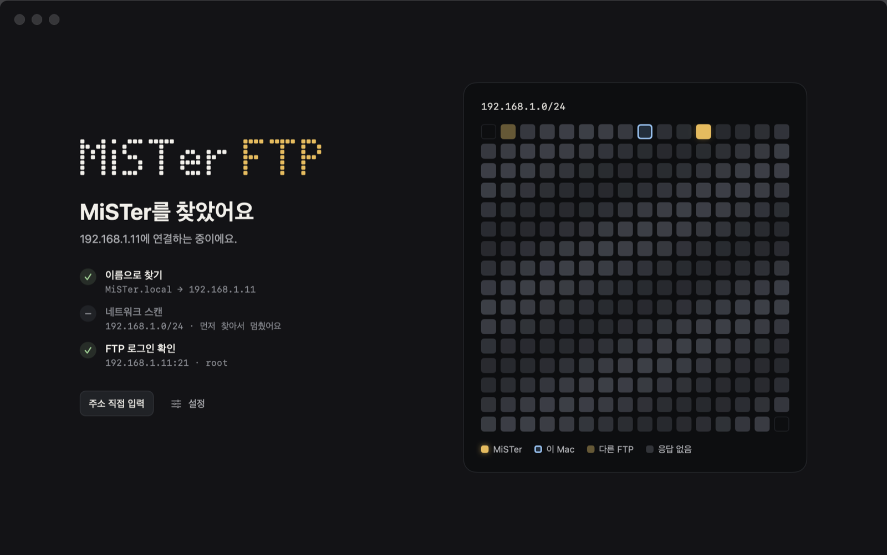
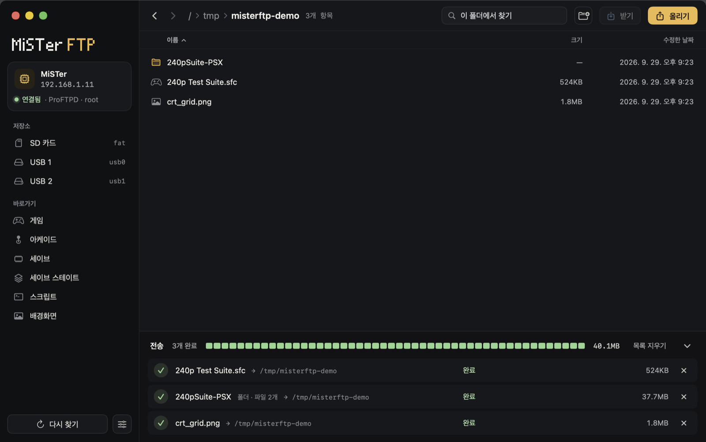

# MiSTer FTP

[English](README.md) | [日本語](README.ja.md)

[MiSTer FPGA](https://github.com/MiSTer-devel/Wiki_MiSTer/wiki)와 파일을 주고받는 macOS 앱입니다. 실행하면 같은 네트워크에서 MiSTer를 자동으로 찾아 SD 카드를 엽니다. 따로 설정할 것은 없습니다.





## 설치

macOS 15 이상이 필요합니다. Apple 실리콘 Mac과 Intel Mac 모두 됩니다.

1. [Releases](https://github.com/Simon-nhelix/mister-ftp/releases)에서 `MiSTer-FTP-x.y.z.zip`을 받아 압축을 풉니다.
2. **MiSTer FTP.app**을 응용 프로그램 폴더로 옮깁니다.
3. 앱을 엽니다. Apple 공증을 받지 않은 앱이라 처음에는 macOS가 막습니다. **완료**를 누르고 **시스템 설정 › 개인정보 보호 및 보안**을 엽니다. 아래로 내려서 "MiSTer FTP" 옆의 **그래도 열기**를 누르세요.
4. "로컬 네트워크의 기기를 찾고 연결"해도 되는지 물으면 **허용**을 누르세요.

3번 대신 터미널에서 이 명령을 실행해도 됩니다.

```sh
xattr -dr com.apple.quarantine "/Applications/MiSTer FTP.app"
```

## 쓰는 법

1. MiSTer를 켜고 Mac과 같은 공유기에 연결합니다.
2. 앱을 실행합니다. MiSTer를 찾으면 SD 카드(`/media/fat`) 목록이 열립니다.

| 하고 싶은 일 | 방법 |
| --- | --- |
| MiSTer로 올리기 | Finder에서 파일·폴더를 창에 끌어다 놓기, 또는 **올리기** (⌘U) |
| Mac으로 받기 | 항목을 고르고 **받기** (⌘D), 파일 더블클릭, 또는 오른쪽 클릭 › 다른 위치에 받기 |
| 폴더 열기 | 더블클릭 또는 Return, 위 폴더는 ⌘↑, 뒤로·앞으로는 ⌘[ ⌘] |
| 새 폴더 · 이름 바꾸기 · 삭제 | ⇧⌘N · ⌘E · ⌘⌫ (오른쪽 클릭 메뉴에도 있어요) |
| 즐겨찾기 넣기·빼기 | 폴더를 열고 머리말의 별 또는 ⌘B (목록에서 폴더 오른쪽 클릭 › 즐겨찾기에 추가) |
| 다시 찾기 · 주소로 연결 | ⇧⌘R · ⌘K |

### 즐겨찾기

자주 가는 폴더를 사이드바에 꽂아 둘 수 있습니다. **저장소** 아래 **즐겨찾기** 칸에 모입니다.

- 넣기: 폴더를 열고 머리말의 별을 누르거나 ⌘B. 목록에서 폴더를 오른쪽 클릭해도 됩니다.
- 사이드바에서 오른쪽 클릭하면 이름 바꾸기, 위·아래로 이동, 제거를 할 수 있습니다. 이름을 비우면 폴더 경로로 다시 만듭니다.
- 앱 안에서 폴더 이름을 바꾸면 즐겨찾기도 따라갑니다. 폴더를 지우면 즐겨찾기도 사라집니다.
- 즐겨찾기에 넣은 폴더가 **바로가기**에도 있으면 바로가기에서는 숨깁니다.

- 받은 파일은 기본으로 `~/Downloads`에 저장됩니다. 설정(⌘,)에서 바꿀 수 있어요.
- 올릴 때 `.DS_Store`, `._*` 같은 macOS 찌꺼기 파일은 건너뜁니다. 한글 파일 이름은 NFC로 바꾸고, FAT/exFAT에서 쓸 수 없는 문자(`\ : * ? " < > |`)는 `_`로 바꿉니다.
- 같은 이름이 있으면 덮어쓸지, 건너뛸지 먼저 묻습니다.
- 삭제는 MiSTer에서 바로 지워지며 되돌릴 수 없습니다.

## 언어

화면은 한국어와 영어를 지원합니다. macOS 언어 설정을 따릅니다. 한국어면 한국어로, 그 밖의 언어면 영어로 보입니다.

이 앱만 다른 언어로 보려면 시스템 설정 › 일반 › 언어 및 지역 › 응용 프로그램에서 MiSTer FTP를 추가하고 언어를 고르세요. 앱을 다시 열면 바뀝니다.

## 업데이트

1.0.0 다음 버전부터 앱이 스스로 업데이트합니다. 하루에 한 번 GitHub에 새 릴리스가 있는지 확인합니다. 새 버전이 있으면 사이드바에 카드가 보입니다(다른 화면에서는 오른쪽 위 배지). 눌러서 새로운 점을 읽고 **업데이트**를 누르세요. 앱이 새 버전을 받아 서명을 확인하고, 스스로 바꾼 뒤 다시 열립니다.

- 바로 확인하려면 **MiSTer FTP › 업데이트 확인…**을 고르세요.
- 매일 확인을 끄려면 설정(⌘,)에서 끄세요.
- 이 프로젝트의 릴리스 키로 서명한 파일만 설치합니다. GitHub에서나 받는 도중에 바뀐 파일은 거부합니다.
- 파일을 전송하는 중에는 전송이 끝날 때까지 기다립니다.
- 1.0.0은 스스로 업데이트하지 못합니다. 다음 버전을 [설치](#설치) 방법대로 한 번만 직접 설치하세요.
- 업데이트 뒤에 macOS가 로컬 네트워크 사용을 다시 물을 수 있습니다. **허용**을 누르세요.

## MiSTer를 찾는 방법

세 가지를 동시에 합니다. 먼저 찾은 쪽으로 연결합니다.

1. 지난번에 연결한 주소 (설정에서 고정 주소도 지정 가능)
2. `MiSTer.local` 이름 (멀티캐스트 DNS)
3. Mac이 속한 사설 네트워크(보통 `/24`)의 21번 포트 스캔

FTP 서버가 MiSTer인지 확인하려고 로그인한 뒤 `/media/fat` 폴더가 있는지 봅니다. 로그인은 이름이나 이전 주소로 찾은 기기, 그리고 인사말이 ProFTPD(MiSTer 기본 서버)인 기기에만 시도합니다. NAS나 공유기 같은 다른 FTP 서버에는 로그인하지 않습니다.

기본 계정은 MiSTer 기본값인 `root` / `1`입니다. 비밀번호를 바꿨다면 연결 화면이나 설정에서 입력하세요. 바꾼 비밀번호는 키체인에 저장됩니다.

## 빌드

Xcode 26 (Swift 6.3) 이상이 필요합니다.

```sh
./scripts/build_app.sh --install   # 릴리스 빌드(Apple 실리콘 + Intel) 후 /Applications에 설치
./scripts/build_app.sh --zip       # 릴리스 빌드를 dist/MiSTer-FTP-<버전>.zip으로 묶기
swift test                         # 단위 테스트
MISTER_FTP_TEST_HOST=192.168.1.11 swift test --filter LiveMiSTerTests   # 실제 MiSTer 테스트
swift scripts/make_icon.swift      # 앱 아이콘(Resources/AppIcon.icns) 다시 만들기
./scripts/sync_strings.sh          # 코드의 화면 문구를 Resources/Localizable.xcstrings에 반영
swift scripts/update_signing.swift check   # 키체인의 릴리스 키가 Info.plist와 맞는지 확인
```

실제 MiSTer 테스트는 MiSTer의 `/tmp`(RAM)에만 쓰고, 끝나면 지웁니다. SD 카드에는 쓰지 않습니다.

화면 문구는 코드에 한국어로 씁니다. 이 한국어가 번역 키입니다. 문구를 더하거나 바꾸면 `./scripts/sync_strings.sh`를 실행하세요. `needs English`로 나온 문구에 영어를 넣으면 됩니다(Xcode로 카탈로그를 열거나 JSON을 직접 편집). 빌드 스크립트가 카탈로그를 `en.lproj`, `ko.lproj`로 바꿔 앱에 넣습니다.

디버그 빌드는 화면 점검용 자동 둘러보기를 지원합니다. 창 캡처를 PNG로 저장하고 MiSTer의 `/tmp`에만 테스트 파일을 씁니다.

```sh
swift build && MISTERFTP_SNAPSHOT_DIR=/tmp/misterftp-shots MISTERFTP_DEMO=1 .build/debug/MiSTerFTP
```

`MISTERFTP_DEMO=dialogs`는 삭제·이름 바꾸기·새 폴더·덮어쓰기 확인창의 실제 버튼을 누르고, MiSTer에서 결과를 확인합니다. 이것도 `/tmp`에서만 작업합니다. `MISTERFTP_DEMO=updateui`는 네트워크 없이 업데이트 화면들을 보여 줍니다(버전 번호가 있도록 앱 번들 안에서 실행하세요).

```sh
swift build && MISTERFTP_DEMO=dialogs .build/debug/MiSTerFTP
```

디버그 빌드에는 번역 파일이 없어서 코드의 한국어가 그대로 보입니다. 영어 화면을 보려면 카탈로그를 빌드 폴더에 넣고 언어를 지정하세요.

```sh
for c in Resources/*.xcstrings; do xcrun xcstringstool compile "$c" -o "$(swift build --show-bin-path)"; done
.build/debug/MiSTerFTP -AppleLanguages '(en)'
```

## 새 버전 릴리스

업데이트 기능은 릴리스 키로 서명한 압축 파일만 설치합니다. 비밀 키는 릴리스를 만드는 Mac의 로그인 키체인에만 있습니다(항목 이름 "MiSTer FTP update signing key"). `Resources/Info.plist`에는 짝이 되는 공개 키(`MFTPUpdatePublicKey`)와 확인할 저장소(`MFTPUpdateRepository`)가 들어 있습니다.

1. Mac마다 한 번 `swift scripts/update_signing.swift generate`를 실행합니다. 키가 이미 있으면 공개 키만 Info.plist에 씁니다. 키체인 항목은 꼭 백업하세요. 키를 잃으면 설치된 앱이 스스로 업데이트할 수 없고, 모두가 다음 버전을 직접 받아야 합니다.
2. `Resources/Info.plist`에서 새 버전을 정합니다: `CFBundleShortVersionString`, 그리고 더 큰 `CFBundleVersion`.
3. `./scripts/build_app.sh --zip`을 실행합니다. `dist/MiSTer-FTP-<버전>.zip`과 서명 파일 `dist/MiSTer-FTP-<버전>.zip.sig`가 생깁니다.
4. 두 파일을 태그가 `v<버전>`인 릴리스에 올립니다. 릴리스 설명(Markdown)은 앱의 업데이트 창에 그대로 보입니다.

```sh
gh release create v1.0.1 dist/MiSTer-FTP-1.0.1.zip dist/MiSTer-FTP-1.0.1.zip.sig --title "MiSTer FTP 1.0.1" --notes-file NOTES.md
```

앱은 `releases/latest`를 보므로 초안(draft)과 시험판(pre-release)은 안내하지 않습니다.

## 구조

```text
Sources/FTPKit/      FTP 클라이언트(POSIX 소켓, 패시브 모드, MLSD), 목록 파서, LAN 탐색
Sources/UpdateKit/   업데이트: GitHub 릴리스 확인, Ed25519 서명 확인, 받기와 앱 교체
Sources/MiSTerFTP/   SwiftUI 앱: 탐색 화면, 파일 목록, 전송 대기열, 설정, 업데이트
Tests/FTPKitTests/   파서 테스트와 실제 MiSTer 테스트
Tests/UpdateKitTests/ 서명한 테스트 앱으로 하는 업데이트 테스트
scripts/             앱 번들 빌드·설치, 릴리스 서명, 아이콘 생성, 화면 문구 동기화
Resources/           Info.plist, AppIcon.icns, 문자열 카탈로그(Localizable, InfoPlist)
docs/                README 스크린샷
```

## 라이선스

MIT. [LICENSE](LICENSE)를 보세요.
