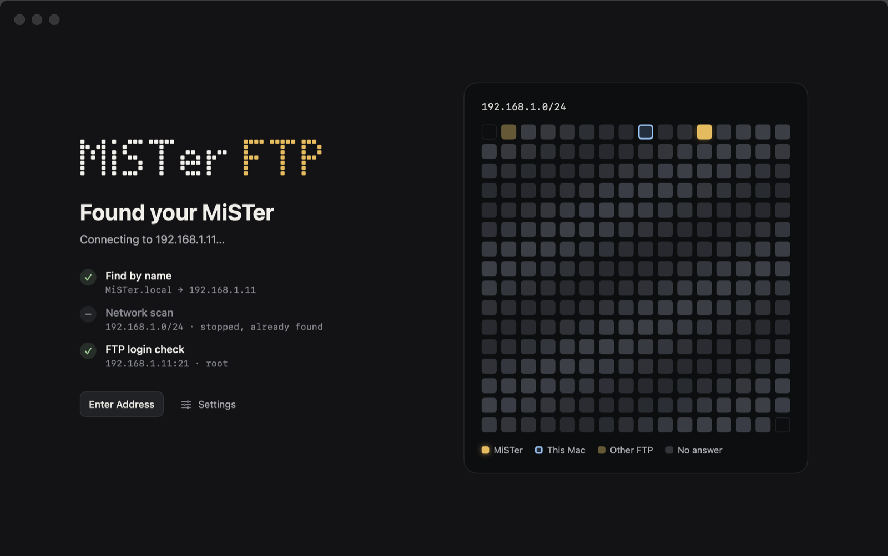
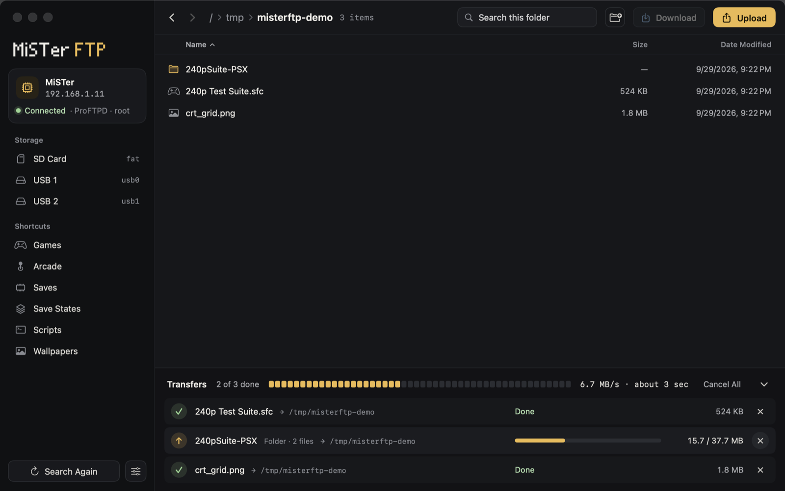

# MiSTer FTP

[한국어](README.ko.md)

A small macOS app for moving files between your Mac and a [MiSTer FPGA](https://github.com/MiSTer-devel/Wiki_MiSTer/wiki). Open it, and it finds the MiSTer on your network and opens its SD card. There is nothing to set up.





## Install

Requires macOS 15 or later, on Apple silicon or Intel.

1. Download `MiSTer-FTP-x.y.z.zip` from [Releases](https://github.com/Simon-nhelix/mister-ftp/releases) and unzip it.
2. Move **MiSTer FTP.app** to your Applications folder.
3. Open it. The app is not notarized by Apple, so macOS blocks it the first time. Click **Done**, then open **System Settings › Privacy & Security**. Scroll down and click **Open Anyway** next to "MiSTer FTP".
4. When macOS asks to let MiSTer FTP find and connect to devices on your local network, click **Allow**.

Instead of step 3, you can run this command in Terminal:

```sh
xattr -dr com.apple.quarantine "/Applications/MiSTer FTP.app"
```

## Use

1. Turn on the MiSTer and connect it to the same router as your Mac.
2. Open MiSTer FTP. When it finds the MiSTer, it shows the SD card (`/media/fat`).

| To do this | Do this |
| --- | --- |
| Upload to the MiSTer | Drag files or folders from Finder onto the window, or click **Upload** (⌘U) |
| Download to the Mac | Select items and click **Download** (⌘D), double-click a file, or right-click › Download To… |
| Open a folder | Double-click or press Return. Enclosing folder: ⌘↑. Back and forward: ⌘[ ⌘] |
| New folder · Rename · Delete | ⇧⌘N · ⌘E · ⌘⌫ (also in the right-click menu) |
| Search again · Connect to an address | ⇧⌘R · ⌘K |

- Downloads go to `~/Downloads`. You can change the folder in Settings (⌘,).
- Uploads skip macOS junk files such as `.DS_Store` and `._*`. Names are stored in composed Unicode (NFC), and characters that FAT/exFAT can't store (`\ : * ? " < > |`) become `_`.
- If an item with the same name already exists, the app asks whether to replace it or skip it.
- Delete removes items from the MiSTer right away. You can't undo it.

## Language

The app is in English and Korean, and it follows your Mac's language: Korean shows Korean, and every other language shows English.

To use a different language for this app only, open System Settings › General › Language & Region, add MiSTer FTP under Applications, and choose a language. The change applies the next time you open the app.

## How it finds the MiSTer

The app tries three ways at the same time and connects to the first one that answers:

1. The address it connected to last time (or a fixed address that you set in Settings)
2. The name `MiSTer.local` (multicast DNS)
3. A scan of port 21 on your Mac's private network (usually a `/24`)

To make sure an FTP server is a MiSTer, the app logs in and looks for the `/media/fat` folder. It logs in only to a device found by name or by the last address, or to a server whose greeting says ProFTPD (the MiSTer default server). It does not log in to other FTP servers, such as a NAS or a router.

The account is the MiSTer default, `root` / `1`. If you changed the password, enter it on the connection screen or in Settings. The app saves a changed password in your keychain.

## Build from source

Requires Xcode 26 (Swift 6.3) or later.

```sh
./scripts/build_app.sh --install   # release build (Apple silicon + Intel), installed to /Applications
./scripts/build_app.sh --zip       # release build, packed as dist/MiSTer-FTP-<version>.zip
swift test                         # unit tests
MISTER_FTP_TEST_HOST=192.168.1.11 swift test --filter LiveMiSTerTests   # tests against a real MiSTer
swift scripts/make_icon.swift      # draw the app icon again (Resources/AppIcon.icns)
./scripts/sync_strings.sh          # collect UI strings into Resources/Localizable.xcstrings
```

The live tests write only to `/tmp` on the MiSTer (RAM) and remove their files at the end. They never write to the SD card.

UI strings are written in Korean in the code, and the Korean text is the translation key. After you add or change a string, run `./scripts/sync_strings.sh`. Then add English for each string that it lists as `needs English` (open the catalog in Xcode, or edit the JSON). The build script turns the catalogs into `en.lproj` and `ko.lproj` tables in the app.

Debug builds can tour the main screens and save window snapshots as PNG files. The tour writes test files only to `/tmp` on the MiSTer.

```sh
swift build && MISTERFTP_SNAPSHOT_DIR=/tmp/misterftp-shots MISTERFTP_DEMO=1 .build/debug/MiSTerFTP
```

`MISTERFTP_DEMO=dialogs` presses the real buttons in the Delete, Rename, New Folder and Replace dialogs, then checks the result on the MiSTer. It also works only under `/tmp`.

```sh
swift build && MISTERFTP_DEMO=dialogs .build/debug/MiSTerFTP
```

A debug build has no translation tables, so it shows the Korean text from the code. To see English, put the tables next to the debug build and choose the language:

```sh
for c in Resources/*.xcstrings; do xcrun xcstringstool compile "$c" -o "$(swift build --show-bin-path)"; done
.build/debug/MiSTerFTP -AppleLanguages '(en)'
```

## Project layout

```text
Sources/FTPKit/      FTP client (POSIX sockets, passive mode, MLSD), list parser, LAN discovery
Sources/MiSTerFTP/   SwiftUI app: discovery screen, file browser, transfer queue, settings
Tests/FTPKitTests/   parser tests and live MiSTer tests
scripts/             app bundle build and install, app icon, string sync
Resources/           Info.plist, AppIcon.icns, string catalogs (Localizable, InfoPlist)
docs/                README screenshots
```

## License

MIT. See [LICENSE](LICENSE).
